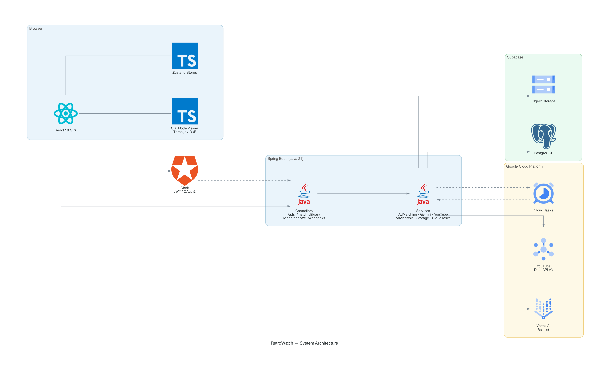

# RetroWatch


A nostalgic streaming platform that recreates the golden age of television with AI-matched period commercials.

RetroWatch lets you watch any YouTube video through an authentic CRT TV simulation, complete with Gemini AI-powered commercials that are matched to the content and inserted at natural break points — just like it's 1985.

## Table of Contents

- [Background](#background)
- [Architecture](#architecture)
- [Install](#install)
- [Usage](#usage)
- [API](#api)
- [Maintainers](#maintainers)
- [Contributing](#contributing)
- [License](#license)

## Background

Modern streaming stripped out the communal, serendipitous texture of old TV. RetroWatch is built to bring that back: a 3D CRT television rendered in Three.js, YouTube playback embedded inside it, and an AI pipeline (Vertex AI / Gemini) that picks era-appropriate ads from your own library and splices them in at the right moments.

The project is a full-stack mono-repo: a React 19 SPA talks to a Spring Boot 4 / Java 21 backend, with Supabase (PostgreSQL + object storage) for persistence and Clerk for auth. Google Cloud Tasks drives async ad analysis, and the YouTube Data API v3 provides video metadata for break-point detection.

## Architecture



Every user action follows a path through the same layers: React SPA → Clerk JWT → Spring Boot → external services → Supabase. Here is how each major flow works end-to-end.

#### 1. Authentication

1. User signs in via the React SPA. Clerk handles the OAuth2 / email flow and issues a signed JWT.
2. The frontend attaches the JWT as a `Bearer` token on every subsequent request.
3. Spring Boot's auth filter validates the JWT with Clerk's public keys before the request reaches any controller. Unauthenticated requests are rejected at this boundary.

#### 2. Uploading an Ad

1. **Frontend** — user selects a video file (MP4, max 100 MB). React uploads it to `POST /api/protected/ads/upload`.
2. **AdController** — validates the MIME type and file size, then hands off to AdService.
3. **AdService** — streams the file to Supabase Object Storage (`ads` bucket) and writes an `AdUpload` row in PostgreSQL (file URL, storage path, size, `analysisStatus = pending`).
4. **AdAnalysisService (async)** — Spring `@Async` fires a background job immediately:
   - Downloads the ad video from storage to a local temp file.
   - Sends video bytes to **Vertex AI Gemini** with a structured JSON schema.
   - Gemini returns: categories, tone, era style (1950s–modern), keywords, transcript, brand name, energy level (1–10).
   - Results are written to the `AdMetadata` table; `AdUpload.analysisStatus` flips to `completed` (or `failed`).
   - Temp files are deleted.
5. **Frontend** — the upload call returns as soon as step 3 finishes. Analysis happens in the background; the UI can poll the ad list to see when analysis completes.

#### 3. Analyzing a YouTube Video

1. **Frontend** — user pastes a YouTube URL. React calls `POST /api/protected/video/analyze`.
2. **VideoAnalysisController** → **YouTubeAnalysisService**:
   - Extracts the video ID and checks the `VideoAnalysis` table for a cached result. If a cached entry exists it is returned immediately.
   - Otherwise, fetches metadata (title, description, duration, category, tags) from the **YouTube Data API v3**.
   - Sends that metadata to **Vertex AI Gemini** which returns: categories, topics, sentiment, and a list of ad-break suggestions (timestamp + priority + reason + suggested ad categories).
3. The full analysis is written to the `VideoAnalysis` table (keyed by video ID) and returned to the frontend.

#### 4. Matching Ads to a Video

1. **Frontend** — user selects a video URL and a set of uploaded ads, then calls `POST /api/protected/match`.
2. **AdMatchingController** → **AdMatchingService**:
   - Calls YouTubeAnalysisService (returns cached analysis if available).
   - Loads `AdUpload` + `AdMetadata` rows for every selected ad.
   - Scores each ad against the video using a weighted formula:
     - Category overlap × 0.40 (Jaccard similarity)
     - Tone compatibility × 0.25 (tone vs. sentiment matrix)
     - Era style bonus × 0.20 (retro-era ads score higher)
     - Energy level match × 0.15
   - Ranks ads by score descending.
   - Assigns top-scoring ads to high-priority break timestamps, enforcing a 120-second minimum gap between ads and capping at `maxAds` (default 3).
3. Returns a `MatchResponse`: video analysis summary + a sorted `AdScheduleItem` list (ad URL, insertion timestamp, duration, score, reason). **No database writes happen here**; matching is stateless.

#### 5. Processing a Video (async pipeline)

1. **Frontend** — user triggers processing with a chosen shader style. React calls `POST /api/protected/process-video`.
2. **ProcessVideoController**:
   - Confirms the video and ads exist in storage.
   - Checks that no processing task is already queued for this user.
   - Creates a `ProcessingStatus` row (jobId, stage = `QUEUED`, progress = 0%).
   - Enqueues a **Cloud Tasks** job pointing at the internal worker endpoint.
3. **VideoWorkerController** (Cloud Tasks callback, OIDC-verified):
   The worker updates `ProcessingStatus` as it moves through stages:
   | Stage | Progress |
   |---|---|
   | DOWNLOADING — fetches video + ads from storage | 5% |
   | ANALYZING — uploads video to Gemini Files API; Gemini returns scene breaks and ad insertion points | 15–25% |
   | APPLYING_EFFECTS — FFmpeg applies the chosen shader (VHS / CRT / VHS-CRT / Glitch) | 40% |
   | INSERTING_ADS — FFmpeg splices ads at Gemini-determined timestamps | 55% |
   | ADDING_AUDIO_EFFECTS — overlays vintage crackle audio | 70% |
   | UPLOADING — final MP4 written to `processed-videos` bucket | 85% |
   | COMPLETED | 100% |
   - Saves a `ProcessedVideo` row (shader style, output URL, insertion points, video summary).
   - Deletes all temp files.
4. **Frontend** — polls `ProcessingStatus` to drive a progress bar. When status is `COMPLETED`, the signed URL for the processed video is available.

#### 6. Watching (Playback)

1. **Frontend** — fetches a signed URL for the processed video (1-hour expiry) via the library endpoint.
2. **CRTModelViewer** (Three.js / React Three Fiber) renders a 3D CRT television. The processed video — with effects and ads already baked in — plays inside the CRT model.
3. After viewing, React posts a watch history entry (`POST /api/protected/library/history`) recording the YouTube URL and which ads were shown.
4. **LibraryController** writes a `watch_history` row in Supabase; `GET /api/protected/library/history` retrieves the user's viewing history.

## Install

### Dependencies

- Node.js 20+ and pnpm
- Java 21+
- Docker and Docker Compose
- Google Cloud project with Vertex AI enabled
- Supabase project
- Clerk application

### Environment setup

Create a `.env` file in the project root:

```bash
# Clerk
VITE_CLERK_PUBLISHABLE_KEY=pk_test_...

# Supabase
SUPABASE_URL=https://your-project.supabase.co
SUPABASE_ANON_KEY=eyJ...
SUPABASE_SERVICE_ROLE_KEY=eyJ...
SUPABASE_DB_URL=postgresql://postgres:...

# Google Cloud / Vertex AI
GCP_PROJECT_ID=your-gcp-project
GCP_LOCATION=us-central1
GEMINI_MODEL=gemini-2.0-flash-001
```

### Install

```bash
# Docker (recommended)
./run-local.sh

# Or manually
docker-compose up --build
```

## Usage

### Docker

```bash
docker-compose up --build
```

Access the app at `http://localhost:8080`.

### Kubernetes (Tilt)

```bash
tilt up
```

### Manual

```bash
# Frontend
cd frontend
pnpm install
pnpm dev        # http://localhost:5173

# Backend (separate terminal)
cd backend
mvn spring-boot:run
```

### CLI — frontend scripts

```bash
cd frontend
pnpm dev        # dev server
pnpm build      # production build
pnpm lint       # lint
```

### CLI — backend scripts

```bash
cd backend
mvn test                # run tests
mvn package             # build JAR
mvn spring-boot:run     # run locally
```

### Deploy to Google Cloud Run

```bash
gcloud builds submit --config=cloudbuild.yaml
```

## API

All routes are under `/api/protected/` and require a valid Clerk JWT.

| Endpoint | Method | Description |
|---|---|---|
| `/api/protected/ads` | GET, POST | List or upload ads |
| `/api/protected/ads/{id}/analyze` | POST | Trigger Gemini analysis on an ad |
| `/api/protected/library/history` | GET, POST | Watch history |
| `/api/protected/video/analyze` | POST | Analyze a YouTube video for break points |
| `/api/protected/match` | POST | Build an ad schedule for a video |

For full request/response shapes see the controller source in `backend/src/main/java/com/richwavelet/backend/api/`.

## Maintainers

[@teddymalhan](https://github.com/teddymalhan)

## Contributing

Questions and bug reports go to [GitHub Issues](https://github.com/teddymalhan/RetroWatch/issues).

PRs are welcome. Please open an issue first to discuss significant changes. There are no formal commit sign-off requirements at this time.

## License

[Unlicense](LICENSE) — public domain. Teddy Malhan.
